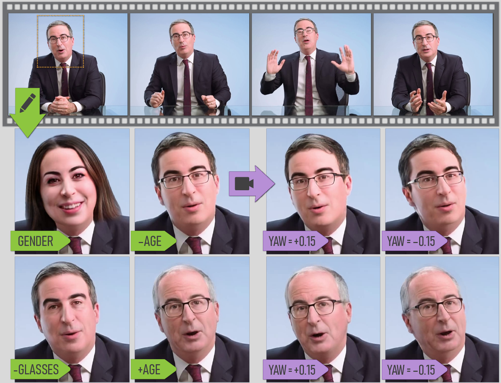

# VIVE3D &mdash; Official PyTorch implementation




<a href='https://arxiv.org/abs/2203.07293'>**VIVE3D: Viewpoint-Independent Video Editing using 3D-Aware GANs**</a><br>
****Anna Frühstück, Nikolaos Sarafianos, Yuanlu Xu, Peter Wonka, Tony Tung****<br>
***published at CVPR 2023***<br>
[Project Webpage](http://afruehstueck.github.io/vive3D) | [Video](https://www.youtube.com/watch?v=qfYGQwOw8pg)

**Abstract**
We introduce VIVE3D, a novel approach that extends the capabilities of image-based 3D GANs to video editing and is able to represent the input video in an identity-preserving and temporally consistent way. We propose two new building blocks. First, we introduce a novel GAN inversion technique specifically tailored to 3D GANs by jointly embedding multiple frames and optimizing for the camera parameters. Second, besides traditional semantic face edits (e.g. for age and expression), we are the first to demonstrate edits that show novel views of the head enabled by the inherent properties of 3D GANs and our optical flow-guided compositing technique to combine the head with the background video. Our experiments demonstrate that VIVE3D generates high-fidelity face edits at consistent quality from a range of camera viewpoints which are composited with the original video in a temporally and spatially-consistent manner.

## Prerequisites
This code has been tested with `pytorch 1.12.1` and `cuda 11.3`.

The requirements for this project are largely the same as for the [EG3D code base](https://github.com/NVlabs/eg3d), which our work is based on.
We also provide our conda environment in `environment_vive3D.yml`, which you can install using `conda env create -f environment_vive3D.yml`.

In order to load models trained using `EG3D`, you also need to copy three directories from NVIDIA's code repository to the vive3D directory:
[`torch_utils`](https://github.com/NVlabs/eg3d/tree/main/eg3d/torch_utils),
[`dnnlib`](https://github.com/NVlabs/eg3d/tree/main/eg3d/dnnlib) and 
[`training`](https://github.com/NVlabs/eg3d/tree/main/eg3d/training) as well as 
[`legacy.py`](https://github.com/NVlabs/eg3d/blob/main/eg3d/legacy.py) and  
[`camera_utils.py`](https://github.com/NVlabs/eg3d/blob/main/eg3d/camera_utils.py).

## Code

We share our VIVE3D pipeline as a Jupyter Notebook (including descriptions) in `VIVE3D_pipeline.ipynb` or as a sequence of python scripts:


First, we invert a selected few frames into the latent space of a pretrained EG3D generator. We devised a customized inversion scheme for this purpose. After inversion, we fine-tune the Generator to improve coherence to our target person's appearance.
```
# inverts the selected faces into the EG3D latent space and fine-tunes to create personalized Generator
python personalize_generator.py --source_video path/to/video \
--generator_path 'models/ffhqrebalanced512-128.pkl' \
--device 'cuda:0' \
--output_intermediate \
--start_sec FRAME_SECOND \
--end_sec FRAME_SECOND \
--frame FRAME_INDEX_1 --frame FRAME_INDEX_2 --frame FRAME_INDEX_3 \ 
--device 'cuda:0'

```

Then, we invert a video sequence into the personalized Generator latent space.
```
# runs an inversion into the personalized Generator latent space for a video sequence
python invert_video.py --savepoint_path path/to/savepoints \
--source_video path/to/video \
--start_sec 60 \
--end_sec 70 \ 
--device 'cuda:0'
```

We can now use the stack of inverted latents and angles to edit the appearance of our subject, and change the head's angle.
```
python edit_video.py --savepoint_path path/to/savepoints \
--source_video path/to/video \
--start_sec 60 \
--end_sec 70 \
--edit_type 'young' --edit_strength 2.0 \ 
--device 'cuda:0'

```

## Pre-trained Models
Our code is using a face model trained using the [EG3D code base by NVIDIA](https://github.com/NVlabs/eg3d). You can download the model `ffhqrebalanced512_128.pkl` from [Nvidia](https://github.com/NVlabs/eg3d/blob/main/docs/models.md). Put it into the project directory in the `models` folder.

**Source Videos**
You can use any source video with sufficiently high resolution as an input- and target-video. 

## Citation
If you use this code for your research, please cite our paper.
```
@inproceedings{Fruehstueck2023VIVE3D,
  title = {{VIVE3D}: Viewpoint-Independent Video Editing using {3D-Aware GANs}},
  author = {Fr{\"u}hst{\"u}ck, Anna and Sarafianos, Nikolaos and Xu, Yuanlu and Wonka, Peter and Tung, Tony},
  booktitle = {Proceedings of the IEEE/CVF International Conference on Computer Vision and Pattern Recognition (CVPR)},
  year = {2023}
}
```

## License
Our code is available under the  TODO license. 

## Acknowledgements
This project was the product of an internship by Anna Frühstück with Meta Reality Labs Research Sausalito.

We thank the EG3D team at NVIDIA for providing their code.
